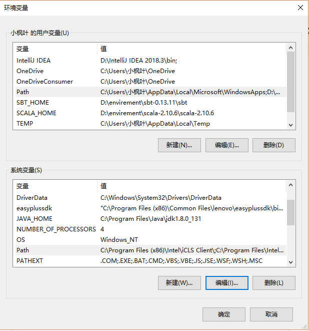
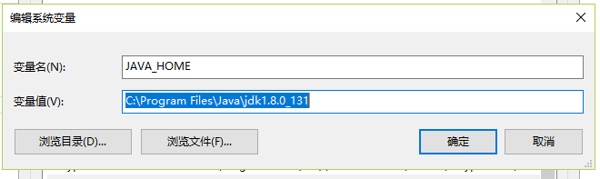
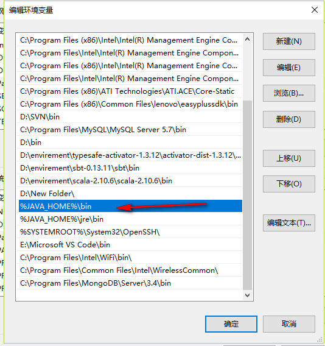
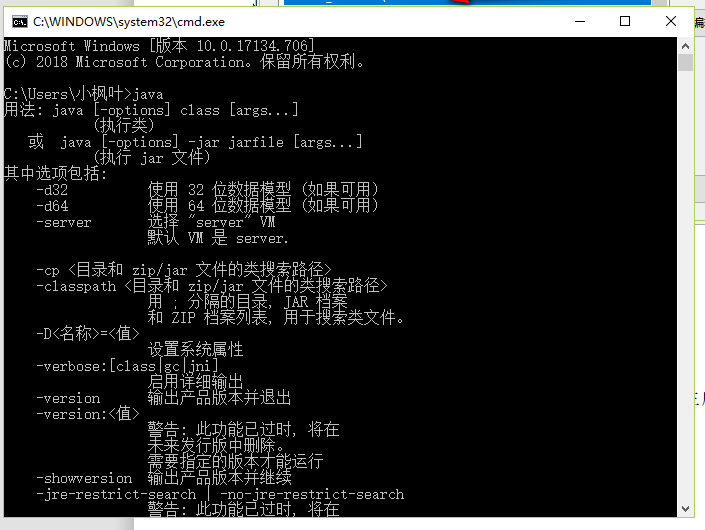
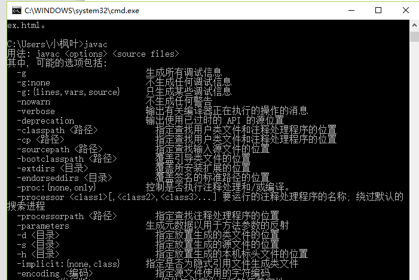

# 学习ionic需要预安装的环境程序
## 1、安装 cordova
```
 npm install -g cordova
```
## 2、安装 ionic
```
npm install -g ionic@3.20.1 (注意：一定要安装这个版本的ionic)
```
## 3、查看版本
 ```
 cordova  -v
 Ionic  -v
 ```
## 4、下载jdk 安装一直下一步  ps:记住安装的目录
https://pan.baidu.com/s/1HFFVgRm4AaEVcQM3juH5lA  fmok

.exe文件是windows的jdk   

.dmg文件是mac的jdk

双击安装下一步下一步安装jdk
## 5、配置环境变量
配置jdk的环境变量




在系统变量中新建一个JAVA_HOME 设置值为 Java的sdk的安装根目录



在系统变量的Path中添加 ;%JAVA_HOME%\bin;%JAVA_HOME%\jre\bin



## 6、验证jdk是否安装成功 
在控制台中输入java 、javac 中输出对应的代码说明成功，如下：



## 7、下载android Studio
https://developer.android.google.cn/

下载后双击下一步下一步安装如下图

注意：sdk 目录不能有中文，不能有空格。如果 C 盘足够用回头就放在 C 盘

打开的时候如果报错，点击取消。

完成之后finish；

