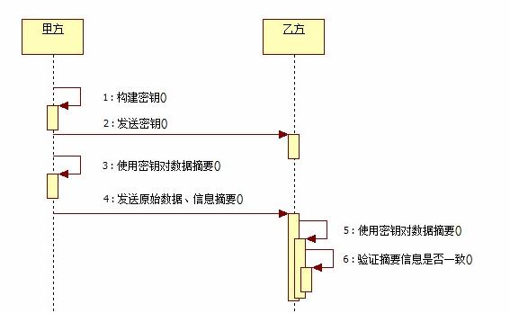
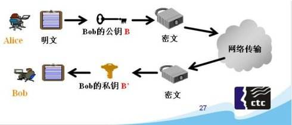
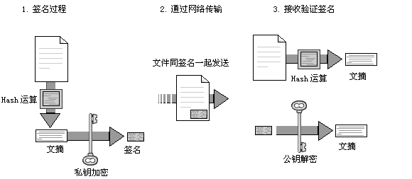

# 十四.crypto

`crypto`是`node.js`中实现加密和解密的模块，在`node.js`中，使用`OpenSSL`类库作为内部实现加密解密的手段`OpenSSL`是一个经过严格测试的可靠的加密与解密算法的实现工具

## 1.散列（哈希）算法

散列算法也叫哈希算法，用来把任意长度的输入变成固定长度的输出，常见的有`md5`,`sha1`等

- 相同的输入会产生相同的输出
- 不同的输出会产生不同的输出
- 任意的输入长度输出的长度时相同的
- 不能从输出推算出输入的值


### 1.1 获取所有的散列算法

```js
console.log(crypto.getHashes())
```

### 1.2 语法说明

```js
crypto.createHash(algorithm) // 创建HASH对象
hash.update(data, [input_encoding]) // 增加要添加摘要的数据，摘要输出前可以使用多次update
hash.digest([encoding]) // 输出摘要内容，输出后则不能再添加摘要内容
```

### 1.3 散列算法示例

```js
var crypto = require("crypto")
var md5 = crypto.createHash("md5") // 返回哈希算法
var md5Sum = md5.update("hello") // 指定要摘要的原始内容，可以在摘要被输出之前使用多次update方法来添加摘要内容
var result = md5Sum.digest("hex") // 输出摘要，在使用digest方法之后不能再向hash对象追加摘要内容
console.log(result)
```

多次 update

```js
var fs = require("fs")
var shasum = crypto.createHash("sha1") // 返回sha1哈希算法
var rs = fs.createReadStream(" ./readme.txt")
rs.on("data", function(data) {
  shasum.update(data) // 指定要摘要的原始内容，可以在摘要被输出之前使用多次update方法类添加摘要内容
})
rs.on("end", function() {
  var result = shasum.digest("hex") //摘要输出，在使用digest方法之后不能再向hash对象追加摘要内容
  console.log(result)
})
```

## 2.HMAC 算法

HMAC 算法将散列算法与一个密钥结合在一起，以组织对签名完整性的破坏



### 2.1 语法

```js
let hmac = crypto.createHmac(algorithm, key)
hmac.update(data)
```

- algorithm 是一个可用的摘要算法，例如 sha1、md5、sha256
- key 为一个字符串，用于指定一个 PEM 格式的密钥

### 2.2 生成私钥

PEM 时 OpenSSL 的标准格式，OpenSSL 使用 PEM 文件格式存储证书和密钥，是基于 Base64 编码的证书

```bash
openssl genrsa -out rsa_private.key 1024
```

### 2.3 示例

```js
let pem = fs.readFileSync(path.join(__dirname, "./rsa_private.key"))
let key = pem.toString("ascii")
let hmac = crypto.createHmac("sha1", key)
let rs = fs.createReadStream(path.join(__dirname, "./1.txt"))
rs.on("data", function(data) {
  hmac.update(data)
})
rs.on("end", function() {
  let result = hmac.digest("hex")
  console.log(result)
})
```

## 3.对称加密

- blowfish 算法是一种对称的加密算法，对称的意思就是加密和解密使用的是同一个密钥
  

```js
var crypto = require("crypto")
var fs = require("fs")
let str = "hello"
let cipher = crypto.createCipher(
  "blowfish",
  fs.readFileSync(path.join(__dirname, "rsa_private.key"))
)
let encry = cipher.update(str, "utf8", "hex")
encry += cipher.final("hex")
console.log(encry)
let deciper = crypto.createDecipher(
  "blowfish",
  fs.readFileSync(path.join(__dirname, "rsa_private.key"))
)
let deEncry = deciper.update(encry, "hex", "utf8")
deEncry += deciper.final("utf8")
console.log(deEncry)
```

## 4.非对称加密算法

- 非对称加密算法需要两个密钥：公开密钥（publickey）和私有密钥（privatekey）
- 公钥与私钥是一对，如果用公钥对数据进行加密，只有用对应的私钥才能解密，如果用私钥加密，只能公钥解密
- 因为加密和解密使用的是两个不同的密钥，所以这种算法叫作非对称加密算法



为私钥创建公钥

```bash
openssl rsa -in rsa_private.key -pubout -out rsa_public.key
```

```js
var crypto = require("crypto")
var fs = require("fs")
let key = fs.readFileSync(path.join(__dirname, "rsa_private.key"))
let secret = crypto.publicEncrypt(cert, buffer) //公钥加密
let result = crypto.privateDecrypt(key, secret) // 私钥解密
console.log(result.toString())
```

## 5.签名

在网络中，私钥的拥有者可以在一段数据被发送之前先对数据进行`签名`得到一个签名，通过网络把此数据发送给数据接收者之后，数据的接收者可以通过`公钥`来对该签名进行验证，以确保这段数据是私钥的拥有者所发出的原始数据，并且在网络中的传输过程中未被修改



```js
let private = fs.readFileSync(path.join(__dirname, "rsa_private.key"), "ascii")
let public = fs.readFileSync(path.join(__dirname, "rsa_public.key", "ascii"))
let str = "abcd"
let sign = crypto.createSign("RSA_SHA256")
sign.update(str)
let signed = sign.sign(private, "hex")
let verify = crypto.createVerify("RSA-SHA256")
verify.update(str)
let verifyResult = verify.verify(public, signed, "hex") // true
```
