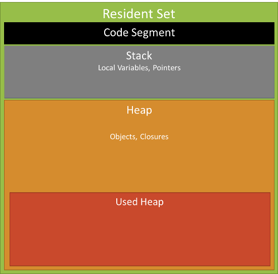

# 十五.process

## 1.进程

- 在 Node.js 中每个应用程序都是一个进程类的实例对象。
- 使用`process`对象代表应用程序，这是一个全局对象，可以通过它来获取 Node.js 应用程序以及运行该程序的用户、环境等各种信息的属性、方法和事件

### 1.1 进程对象属性

- execPath 可执行文件的绝对路径，如`/usr/local/bin/node`
- version 版本号
- version 依赖库的版本号
- platform 运行平台。如 darwin、freebsd、linux、sunos、win32
- stdin 标准输入可写流，同步操作
- stderr 标准输出可写流，同步操作
- argv 属性值为数组
- env 操作系统环境信息
- pid 应用程序进程 ID
- title 窗口标题
- arch 处理器架构 arm ia 32 x 64

```js
process.stdin.resume()
process.stdin.on("data", function(chunk) {
  process.stdout.write(`进程接收到数据：` + chunk)
})
```

```js
process.argv.forEach((val, index, ary) => console.log(index, val))
```

### 1.2 memoryUsage 方法

```js
process.memoryUsage()
```



- rss(resident set size):所有内存占用，包括指令区和堆栈
- heapTotal:"堆"占用的内存，包括用到的和没用到的
- heapUsed:用到的堆的部分
- external:V8 引擎内部的 C++对象占用的内存

### 1.3 nextTick 方法
nextTick方法用于将一个函数推迟到代码中所书写的下一个同步方法执行完毕或异步方法的回调函数开始执行前调用
### 1.4 chdir
chdir方法用于修改Node.js应用程序中使用的当前工作目录，使用方式如下
```js
process.chdir(directory)
```
### 1.5 cwd方法
cwd方法返回当前目录，不使用任何参数
```js
console.log(process.cwd())
```
##