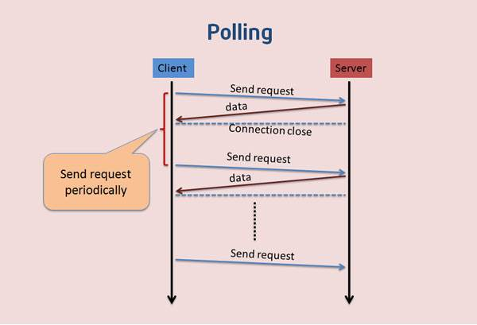

# 一.轮询
轮询是客户端和服务器之间会一直进行连接，每隔一段时间就询问一次

这种范式连接数会很多，一个接受，一个发送。而且每次发送请求都会有 http 的 header，会很耗流量，也会消耗 cpu 的利用率。



## 案例代码

- 客户端定时发送 ajax 请求后端接口，后端返回此时的时间

### 客户端代码

- html

```html
<div id="clock"></div>
```

- js

```js
let clockDiv = document.getElementById("clock")
setInterval(function() {
  let xhr = new XMLHttpRequest()
  xhr.open("GET", "/clock", true)
  xhr.onreadystatechange = function() {
    if (xhr.readyState == 4 && xhr.status == 200) {
      clockDiv.innerHTML = xhr.responseText
    }
  }
  xhr.send()
}, 1000)
```

服务端代码

```js
let express = require("express")
let app = express()
app.use(express.static(__dirname))
app.get("/clock", (req, res) => {
  res.end(new Date().toLocaleString())
})
app.listen(8080)
```

启动服务器，浏览器打开 http://localhost:8080/index.html

<!--  -->