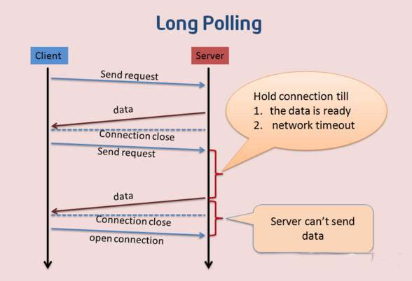

# 二.长轮询

长轮询是对轮询的改进版，客户端发送 http 给服务器之后，看有没有新消息，如果没有新消息，就一直等待。

当有新消息的时候，才会返回给客户端。在某种程度上减小了网络带宽和 cup 利用率等问题。

由于 http 数据包的头部数据量往往很大（通常有 400 多个字节），但是真正被服务器需要的数据却很少（有的只有 10 个字节左右），这样的数据包在网络上周期性的传输，难免对网络带宽是一种浪费。



## 1.案例一：轮询时钟

### 1.1 客户端

::: demo

```vue
<template>
  <div>{{ text }}</div>
</template>

<script>
export default {
  data() {
    return {
      text: "default",
    }
  },
  mounted() {
  let that = this
    setInterval(function() {
      let xhr = new XMLHttpRequest()
      xhr.open("GET", "http://localhost:8080/clock", true)
      xhr.onreadystatechange = function() {
        if (xhr.readyState == 4 && xhr.status == 200) {
          that.text = xhr.responseText
        }
      }
      xhr.timeout = function() {
        send()
      }
      xhr.send()
    }, 1000)
  },
}
</script>
```

:::

### 1.2 服务端

```js
let express = require("express")
let app = express()
app.use(express.static(__dirname))
app.get("/clock", (req, res) => {
  setTimeout(() => {
    res.end(new Date().toLocaleString())
  }, 3000)
})
app.listen(8080)
```

启动服务器，浏览器打开 http://localhost:8080/index.html

<!--  -->
