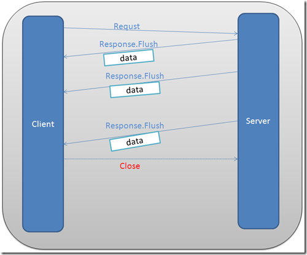

# 三.iframe

通过在 html 页面里嵌入一个隐藏的 iframe，然后将这个 iframe 的 src 属性设为对一个长连接的请求，服务器端就能源源不断地向客户端推送数据。



## 1.案例一

### 1.1 客户端代码

- html

```html
<div id="clock"></div>
<iframe src="/clock" frameborder="0" style="display:none"></iframe>
```

### 1.2 服务端代码

```js
let express = require("express")
let app = express()
app.use(express.static(__dirname))
app.get("/clock", (req, res) => {
  setInterval(() => {
    let date = new Date().toLocaleString()
    res.write(`
        <script type="text/javascript">
        parent.document.getElementById('clock').innerHTML="${date}"
        </script>
        `)
  }, 1000)
})
app.listen(3000, () => {
  console.log(3000)
})
```