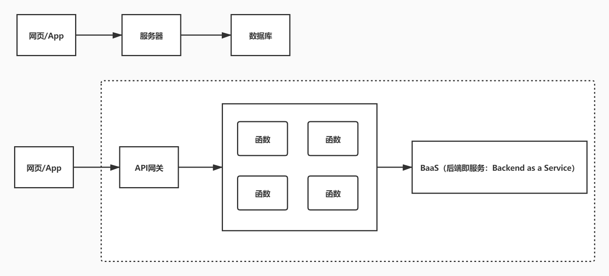
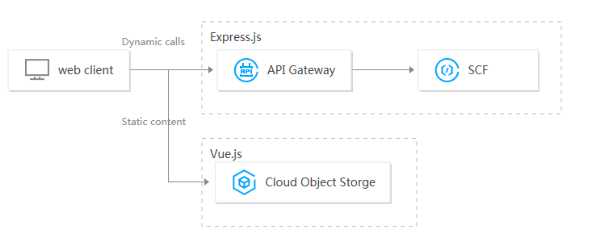
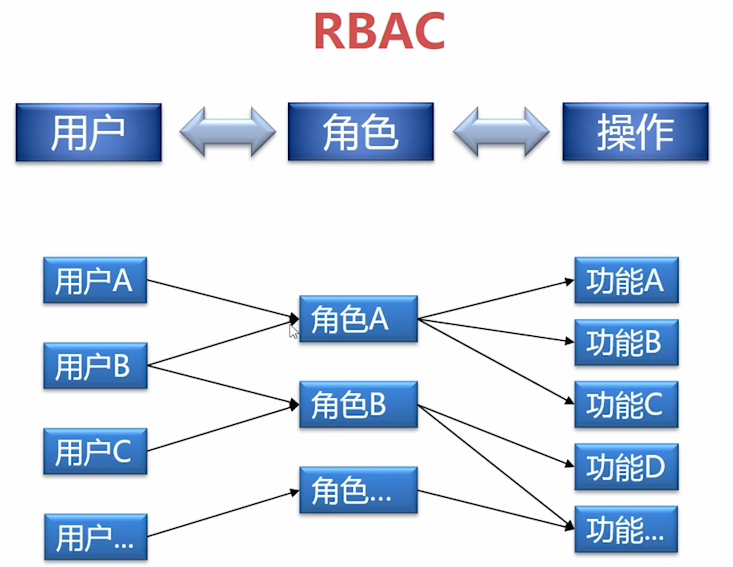

# Serverless

## 1.Serverless 是什么？

### 1.1 Serverless 是什么？

- 无服务器架构几乎封装了所有底层资源管理和系统运维工作
- 服务器部署、扩缩容、运维、监控报警交由云服务器厂商来做
- 前端开发只关注业务，不关注服务器
  

### 1.2 云函数

- 函数服务

## 2.Serverless framework

- Serverless Framework 是业界非常受欢迎的无服务器应用框架，开发者无需关心底层资源即可部署完整可用的 Serverless 应用架构
- Serverless Framework 具有资源编排、自动伸缩、事件驱动等能力，覆盖编码、调试、测试、部署等全生命周期，帮助开发者通过联动云资源，迅速构建 Serverless 应用
- Serverless Framework
- Serverless Framework 文档
- 安装 Serverless Framework

```bash
cnpm i -g serverless
cnpm update -g serverless
serverless -v
```

## 3.Serverless Components

- Serverless Components 是支持多个云资源编排和组织的场景化解决方案，主要基于客户的具体场景，如 Express 框架支持，网站部署等
- Serverless Components 可以有效简化云资源的配置和管理，将网关、COS 和 CAM 等产品联动起来，让客户更多关注场景和业务
- Serverless Framework Components 最佳实践
  - @serverless/tencent-scf 腾讯云云函数组件
  - @serverless/tencent-express 快速部署基于 express.js 的后端服务到腾讯云函数的组件
  - @serverless/tencent-website 快速部署静态网站到腾讯云的组件

### 3.1 云函数 SCF 组件

- 腾讯云 SCF 云函数组件通过使用 Tencent Serverless Framework,基于云上 Serverless 服务（云函数及触发器等），实现`0`配置，便捷开发，快速部署您的第一个云函数
- 查看 SCF
- 全量配置

#### 3.1.1 serverless.yml

- js-yaml

tencent-scf\serverless.yml

```yml
  # serverless.yml
  cmopnent: scf #（必填）引用component的名称，当前用到的是tencent-scf组件
  name: scfdemo #（必填）该组件创建的实例名称
  org: test # (可选)，用于记录组织信息，默认值为您的腾讯云账户 appid
  app: scfApp #（可选）该SCF应用名称
  stage: dev #（可选）用于区分环境信息，默认值是dev

  inputs:
    name: scfFunctionName
    src: ./src
    runtime: Nodejs10.15 # 云函数运行环境
    region: ap-beijing
    handler: index.main_handler
    events:
      - apigw:
        name: serverless_api
        parameters:
          protocols:
            - http
            - https
          serviceName:
          description: The service of Serverless Framework
          environment: release
          endpoints:
            - path: /index
            method: GET
```

#### 3.1.2 src/index.js

```js
"use strict"
exports.main_handler = async (event, context, callback) => {
  console.log("Hello World")
  console.log(event)
  console.log(event["non-exist"])
  console.log(context)
  return "Hello World"
}
```

#### 3.1.3 tencent-scf.env

tencent-scf.env

- 当前默认支持 cli 扫描二维码登录，如果希望配置持久的环境变量/密钥信息，也可以本地创建.env 文件：
- API 密钥管理

```bash
TENCENT_APP_ID=
TENCENT_SECRET_ID=
TENCENT_SECRET_KEY=
```

#### 3.1.4 部署

```bash
sls --debug
```

### 3.2 API 网关组件

- API 网关是将所有 API 的调用统一接入 API 网关层，由网关层负责接入和输出
- API 网关是用户与服务器的连接器，负责 API 接口的托管，实现安全防护和统一监控
- API 网关组件是 serverless-tencent 组件库中的基础组件之一，您可以通过该组件快速且方便地创建、配置和管理腾讯云的 API 网关产品
- 通过 API 网关组件，您可以对一个 API 服务/接口进行完整的创建、配置、部署和删除等操作
- 全量配置

#### 3.2.1 tencent-api\serverless.yml

```yml
#serverless.yml
restApi:
  component: "@serverless/tencent-apigateway"
  inputs:
    region: ap-beijing
    protocol: http
    serviceName: serverless
    environment: release
    endpoints:
      - path: /users
        method: GET
        function:
          functionName: scfFunctionName
```

#### 3.2.2 布署

```bash
sls --debug
```

http://service-mpkd1e88-1258145019.gz.apigw.tencentcs.com/users

### 3.3 布署静态网站

完整配置

#### 3.3.1 serverless.yml

staticwebsite\serverless.yml

```yml
component: website # (必填) 引用 component 的名称，当前用到的是 tencent-website 组件
name: websitedemo # (必填) 该 website 组件创建的实例名称
org: test # (可选) 用于记录组织信息，默认值为您的腾讯云账户 appid
app: websiteApp # (可选) 该 website 应用名称
stage: dev # (可选) 用于区分环境信息，默认值是 dev

inputs:
  code:
    src: ./code
    index: index.html
    error: index.html
  region: ap-beijing
  bucketName: my-bucket
```

#### 3.3.2 index.html

staticwebsite\code\index.html

```html
<!DOCTYPE html>
<html lang="en">
  <head>
    <meta charset="UTF-8" />
    <meta name="viewport" content="width=device-width, initial-scale=1.0" />
    <title>Document</title>
  </head>

  <body>
    static website
  </body>
</html>
```

### 3.4 布署 express 项目

全量配置

#### 3.4.1 创建项目

```bash
mkdir tencent-express
cd tencent-express
npm init -y
cnpm i express -S
```

#### 3.4.2 serverless.yml

tencent-express\serverless.yml

```yml
org: orgDemo # (optional) serverless dashboard org. default is the first org you created during signup.
app: appDemo # (optional) serverless dashboard app. default is the same as the name property.
stage: dev # (optional) serverless dashboard stage. default is dev.
component: express # (required) name of the component. In that case, it's express.
name: expressDemo # (required) name of your express component instance.

inputs:
  src: ./
  region: ap-beijing
  runtime: Nodejs10.15
  apigatewayConf:
    protocols:
      - http
      - https
    environment: release
```

### 3.4.3 sls.js

tencent-express\sls.js

```js
const express = require("express")
const path = require("path")
const app = express()

app.get(`/*`, (req, res) => {
  res.send("i am express")
})
module.exports = app
```

### 3.5 布署 express+layer 项目

层管理
打包压缩阶段

#### 3.5.1 serverless.yml

tencent-express-layer\serverless.yml

```yml
org: orgDemo # (optional) serverless dashboard org. default is the first org you created during signup.
app: appDemo # (optional) serverless dashboard app. default is the same as the name property.
stage: dev # (optional) serverless dashboard stage. default is dev.
component: express # (required) name of the component. In that case, it's express.
name: expressLayerDemo # (required) name of your express component instance.

inputs:
  src:
    src: ./src # (optional) path to the source folder. default is a hello world app.
    exclude:
      - .env
  region: ap-beijing
  layers:
    - name: nodeLayer
      version: 1
  runtime: Nodejs10.15
  apigatewayConf:
    protocols:
      - http
      - https
    environment: release
```

#### 3.5.2 src\sls.js

tencent-express-layer\src\sls.js

```js
const express = require("express")
const path = require("path")
const app = express()

app.get(`/*`, (req, res) => {
  res.sendFile(path.join(__dirname, "index.html"))
})

app.use(function(err, req, res) {
  console.error(err)
  res.status(500).send("Internal Serverless Error")
})

module.exports = app
```

### 3.6 部署 Vue+Express 全栈应用

- 全栈组件（Vue.js+Express.js）用于通过多个 Serverless Components 部署 Serverless 全栈应用程序
- 可以帮助开发者更方便快捷的部署 Serverless 应用，例如利用后端 API 与前端 Vue.js 结合等场景
- serverless Express.js 后端：由腾讯云 Serverless Cloud Function（云函数 SCF） 和腾讯云 API 网关提供相关能力，支持 express.js 框架，帮助开发者架构自己的项目和路由。
- serverless Vue.js 前端：由腾讯云 Cloud Object Storage（对象存储 COS）提供相关存储能力，通过后端 API 传递到前端，并使用 Vue.js 做相关渲染



#### 3.6.1 serverless.yml

vue-fullstack\serverless.yml

```yml
name: tencent-fullstack-vue-application

dashboard:
  component: "@serverless/tencent-website"
  inputs:
    code:
      src: dist
      root: dashboard
      hook: npm run build
    env:
      apiUrl: ${api.url}
api:
  component: "@serverless/tencent-express"
  inputs:
    code: ./api
    functionName: tencent-fullstack-vue-api
    apigatewayConf:
      protocols:
        - https
```

#### 3.6.2 api\package.json

vue-fullstack\api\package.json

```json
{
  "name": "tencent-fullstack-vue-api",
  "version": "0.0.0",
  "dependencies": {
    "cors": "^2.8.5",
    "express": "^4.17.1"
  },
  "license": "ISC"
}
```

#### 3.6.3 api\app.js

vue-fullstack\api\app.js

```js
"use strict"
const express = require("express")
const cors = require("cors")
const app = express()
app.use(cors())

app.get("/", (req, res) => {
  res.send(JSON.stringify({ message: `珠峰架构` }))
})

module.exports = app
```

#### 3.6.4 生成前端项目

```bash
vue create dashboard
```

#### 3.6.5 src\App.vue

vue-fullstack\dashboard\src\App.vue

```vue
<template>
  <div id="app">{{ message }}</div>
</template>

<script>
import "../env"
export default {
  name: "App",
  data() {
    return {
      message: "message",
    }
  },
  mounted() {
    fetch(window.env.apiUrl)
      .then((res) => res.json())
      .then((result) => {
        this.message = result.message
      })
  },
}
</script>
```

## 2.RBAC

- 基于角色的权限访问控制（Role-Based Access Control）
- RBAC（Role-Based Access Control，基于角色的访问控制），就是用户通过角色与权限进行关联
- 一个用户拥有若干角色,每一个角色拥有若干权限。这样，就构造成用户-角色-权限的授权模型
- 在这种模型中，用户与角色之间，角色与权限之间一般是多对多的关系
- 在 RBAC 中最重要的概念包括：用户(User)，角色(Role)，权限(Permission)

### 2.1 示意图



rbac

### 2.2 表设计

#### 2.2.1 用户表(user)

| 字段     | 字段名 | 类型         | 默认 |
| -------- | ------ | ------------ | ---- |
| id       | ID     | int(11)      |
| userName | 用户名 | varchar(255) |
| password | 密码   | varchar(255) |

```sql
CREATE TABLE `user`  (
  `id` int(11) NOT NULL AUTO_INCREMENT,
  `userName` varchar(255),
  `password` varchar(255),
  PRIMARY KEY (`id`)
)

INSERT INTO `user` VALUES (1, 'isadmin', '123456');
INSERT INTO `user` VALUES (2, 'isuser', '123456');
```

#### 2.2.2 角色表(role)

| 字段 | 字段名 | 类型         | 默认 |
| ---- | ------ | ------------ | ---- |
| id   | ID     | int(11)      |
| name | 名称   | varchar(255) |
| desc | 描述   | varchar(255) |

```sql
CREATE TABLE `role`  (
  `id` int(11) NOT NULL AUTO_INCREMENT,
  `name` varchar(255) ,
  `desc` varchar(255) ,
  PRIMARY KEY (`id`)
)

INSERT INTO `role` VALUES (1, 'admin', '管理员');
INSERT INTO `role` VALUES (2, 'user', '普通用户');
```

#### 2.2.3 权限表(permission)

| 字段      | 字段名 | 类型         | 默认 |
| --------- | ------ | ------------ | ---- |
| id        | ID     | int(11)      |
| name      | 名称   | varchar(255) |
| parent_id | 父 ID  | int(11)      |
| icon      | 图标   | varchar(255) |
| key       | 路径   | varchar(255) |
| type      | 类型   | varchar(32)  |

```sql
CREATE TABLE `permission`  (
  `id` int(11) NOT NULL AUTO_INCREMENT,
  `name` varchar(255) ,
  `parent_id` int(11) NULL DEFAULT NULL,
  `icon` varchar(255) ,
  `key` varchar(255) ,
  `type` varchar(255) ,
  PRIMARY KEY (`id`)
);

INSERT INTO `permission` VALUES (1, '授权平台', 0, 'desktop', '/api', 'menu');
INSERT INTO `permission` VALUES (2, '角色管理', 1, 'team', '/api/role', 'menu');
INSERT INTO `permission` VALUES (3, '用户管理', 1, 'user', '/api/user', 'menu');
INSERT INTO `permission` VALUES (4, '权限管理', 1, 'idcard', '/api/resource', 'menu');
INSERT INTO `permission` VALUES (5, '添加用户', 3, 'team', '/api/user/add', 'button');
INSERT INTO `permission` VALUES (6, '删除用户', 3, 'team', '/api/user/delete', 'button');
```

#### 2.2.4 角色用户表(role_user)

| 字段    | 字段名 | 类型 |
| ------- | ------ | ---- |
| role_id | 角色   | ID   | int(11) |
| user_id | 用户   | ID   | int(11) |

```sql
DROP TABLE IF EXISTS `role_user`;
CREATE TABLE `role_user`  (
  `role_id` int(11) NOT NULL,
  `user_id` int(11) NOT NULL,
  PRIMARY KEY (`user_id`, `role_id`)
)

INSERT INTO `role_user` VALUES (1, 1);
INSERT INTO `role_user` VALUES (2, 2);
```

#### 2.2.5 角色权限(role_permission)

| 字段          | 字段名  | 类型    |
| ------------- | ------- | ------- |
| role_id       | 角色 ID | int(11) |
| permission_id | 资源 ID | int(11) |

```sql
CREATE TABLE `role_permission`  (
  `role_id` int(11) NOT NULL,
  `permission_id` int(255) NOT NULL,
  PRIMARY KEY (`role_id`, `permission_id`)
)

INSERT INTO `role_permission` VALUES (1, 1);
INSERT INTO `role_permission` VALUES (1, 2);
INSERT INTO `role_permission` VALUES (1, 3);
INSERT INTO `role_permission` VALUES (1, 4);
INSERT INTO `role_permission` VALUES (1, 5);
INSERT INTO `role_permission` VALUES (1, 6);
INSERT INTO `role_permission` VALUES (2, 1);
INSERT INTO `role_permission` VALUES (2, 4);
```

#### 2.2.6 数据库脚本

cms.sql

## 3.egg.js

tencent-egg

### 3.1. 初始化项目

```bash
mkdir egg-cms && cd egg-cms
cnpm init egg --type=simple
cnpm i
```

### 3.2. 添加模块

```bash
mysql
redis
cd egg-cms
npm install egg-sequelize mysql2 egg-jwt egg-redis --save
```

### 3.3. config\plugin.js

```js
"use strict"

module.exports = {
  sequelize: {
    enable: true,
    package: "egg-sequelize",
  },
  jwt: {
    enable: true,
    package: "egg-jwt",
  },
  redis: {
    enable: true,
    package: "egg-redis",
  },
}
```

### 3.4. config\config.default.js

```js
/* eslint valid-jsdoc: "off" */

'use strict';

/**
 * @param {Egg.EggAppInfo} appInfo app info
 */
module.exports = appInfo => {
  /**
   * built-in config
   * @type {Egg.EggAppConfig}
   **/
  const config = exports = {};

  // use for cookie sign key, should change to your own and keep security
  config.keys = appInfo.name + '_1588409777990_9883';

  // add your middleware config here
  config.middleware = [];

  // add your user config here
  const userConfig = {
+    security: {
+      csrf: false
+    },
+    sequelize: {
+      dialect: "mysql",
+      host: "localhost",
+      port: "3306",
+      database: "egg-cms",
+      username: "root",
+      password: "5f8b8a5d650637f8"
+    },
+    redis: {
+      client: {
+        port: 6379,          // Redis port
+        host: '127.0.0.1',   // Redis host
+        password: 'auth',
+        db: 0,
+      },
+    }
  };

  return {
    ...config,
    ...userConfig,
  };
};
```

### 3.5. model\user.js

app\model\user.js

```js
module.exports = (app) => {
  const { STRING, INTEGER, DATE } = app.Sequelize
  const User = app.model.define("user", {
    id: { type: INTEGER, primaryKey: true, autoIncrement: true },
    userName: STRING(30),
    password: STRING(30),
    created_at: DATE,
    updated_at: DATE,
  })
  return User
}
```

### 3.6. app\controller\home.js

jwt.io
app\controller\home.js

```js
"use strict"

const Controller = require("egg").Controller

class HomeController extends Controller {
  async index() {
    const { ctx } = this
    ctx.body = "hi, egg"
  }
  async currentUser() {
    const { ctx } = this
    const { user } = ctx.state
    this.ctx.body = {
      name: user.userName,
      avatar: "http://img.zhufengpeixun.cn/tuizi.jpg",
      userid: user.id,
    }
  }
  async login() {
    const { ctx, app } = this
    let { userName, password } = ctx.request.body
    const users = await ctx.model.User.findAll({
      where: { userName, password },
      limit: 1,
    })
    if (users.length > 0) {
      let user = users[0]
      ctx.status = 200
      const token = app.jwt.sign(
        {
          id: user.id,
          userName: user.userName,
        },
        app.config.jwt.secret,
        {
          expiresIn: "1h",
        }
      )
      await app.redis.set(`token_${user.id}`, token)
      ctx.body = {
        status: "ok",
        type: "account",
        currentAuthority: "admin",
        token,
      }
    } else {
      ctx.body = {
        status: "error",
      }
    }
  }
}

module.exports = HomeController
```

### 3.7. app\router.js

app\router.js

```js
module.exports = (app) => {
  const { router, controller, jwt } = app
  router.get("/", controller.home.index)
  ;+router.post("/api/login/account", controller.home.login)
  ;+router.get("/api/currentUser", jwt, controller.home.currentUser)
}
```

### 3.8. app.js

app.js

```js
class AppBootHook {
  constructor(app) {
    this.app = app
  }

  async willReady() {
    await this.app.model.sync({ logging: console.log, force: true })
    await this.app.model.query(
      "INSERT INTO users (user_name, password) VALUES ('admin', '123456')"
    )
  }
}

module.exports = AppBootHook
```

## 4. 前端项目

### 4.1. 启动项目

```bash
pro.ant.design
create-umi
umi -v
cnpm create umi
```

### 4.2 config\config.ts

config\config.ts

```ts
export default {
  dev: {
+    '/server/api/': {
+      target: 'http://127.0.0.1:7001',
+      changeOrigin: true,
+      pathRewrite: { '^/server': '' },
+    },
    /* '/api/': {
      target: 'https://preview.pro.ant.design',
      changeOrigin: true,
      pathRewrite: { '^': '' },
    }, */
  },
  test: {
    '/api/': {
      target: 'https://preview.pro.ant.design',
      changeOrigin: true,
      pathRewrite: { '^': '' },
    },
  },
  pre: {
    '/api/': {
      target: 'your pre url',
      changeOrigin: true,
      pathRewrite: { '^': '' },
    },
  },
};
```

### 4.3 services\login.ts

src\services\login.ts

```ts
export async function fakeAccountLogin(params: LoginParamsType) {
+  return request('/server/api/login/account', {
    method: 'POST',
    data: params,
  });
}
```

### 4.4 services\user.ts

src\services\user.ts

```ts
export async function queryCurrent(): Promise<any> {
+  return request('/server/api/currentUser');
}
```

### 4.5 models\login.ts

src\models\login.ts

```ts
effects: {
    *login({ payload }, { call, put }) {
      const response = yield call(fakeAccountLogin, payload);
      yield put({
        type: 'changeLoginStatus',
        payload: response,
      });
      // Login successfully
      if (response.status === 'ok') {
+        if (response.token) {
+          localStorage.setItem('token', response.token);
+        }
        const urlParams = new URL(window.location.href);
```

### 4.6 utils\request.ts

src\utils\request.ts

```ts
const request = extend({
  errorHandler, // 默认错误处理
  credentials: 'include', // 默认请求是否带上cookie
});
+request.interceptors.request.use((url: any, options: any) => {
+  if (localStorage.getItem('token')) {
+    options.headers.Authorization = 'Bearer ' + localStorage.getItem('token')
+  }
+  return { url, options };
+});
export default request;
```
